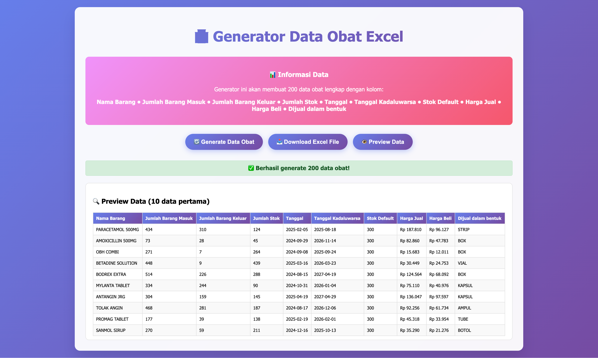

# 💊 Generator Data Obat Excel 🧪

🚀 **Aplikasi Web Powerful untuk Membuat Data Obat Otomatis hingga 200 Baris!**

---

## 🎯 Fitur Utama

✨ Aplikasi ini dapat membuat _dataset_ obat secara otomatis dalam format Excel sebanyak **200 data obat** lengkap dengan informasi penting seperti:

- 🧾 **Nama Barang**
- ➕ **Jumlah Barang Masuk**
- ➖ **Jumlah Barang Keluar**
- 📦 **Jumlah Stok**
- 📅 **Tanggal** & 🧯 **Tanggal Kadaluwarsa**
- 📌 **Stok Default**
- 💰 **Harga Jual & Harga Beli**
- 📦 **Dijual Dalam Bentuk**

---

## 🖥️ Preview Antarmuka

🖼️ Tampilan user interface yang modern dan responsif, lengkap dengan tombol:

- 🔄 **Generate Data Obat**
- ⬇️ **Download Excel File**
- 🔍 **Preview Data**

✅ Setelah klik **Generate**, data akan langsung tersedia dan bisa dilihat/diunduh!

---

📦 Teknologi yang Digunakan:

🧑‍💻 HTML5

🎨 CSS3

🧠 JavaScript (Vanilla)

📊 SheetJS (untuk ekspor Excel)

📈 Use Case

✅ Cocok digunakan untuk:

Proyek akademik (skripsi/TA)

Simulasi manajemen stok obat

Pelatihan Data Science / Machine Learning

Pengujian algoritma clustering / prediksi stok

📌 Cara Menjalankan
Download atau clone repository ini

Buka index.html di browser

Klik tombol “Generate Data Obat” 🎉

Unduh file Excel atau preview data langsung!

🤝 Kontribusi
Kontribusi sangat terbuka! Jika kamu punya ide, fitur baru, atau perbaikan, silakan fork dan pull request ❤️

📜 Lisensi
MIT License — bebas digunakan untuk tujuan edukasi & pengembangan 🚀